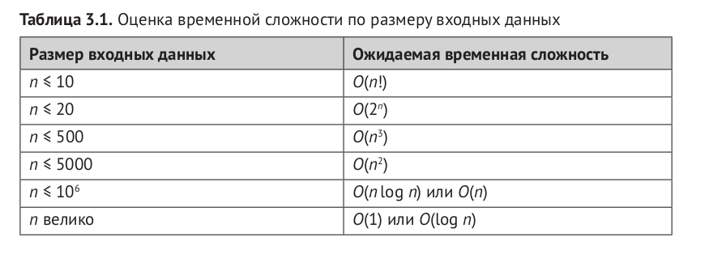

# CSES-problem-set
This is a repository with solutions of CSES problem set on c++.

[CSES](https://cses.fi) - All problems and their description.
#
This is a ["cookbook"](Competitive%20programming.pdf) for programming well, fast and beautiful. There you can find explanations of some tasks from the general list.
#
[Introductory Problems](https://github.com/DenVankov/CSES-problem-set/tree/master/Introductory%20Problems) - Some introduction problems, for example recursion, permutations, chess problems and etc.
#
[Sorting and Searcing](https://github.com/DenVankov/CSES-problem-set/tree/master/Sorting%20and%20Searching) - This problems also include data structure, so before proceeding with the decision, read this chapter.
#
Time complexity for various input

